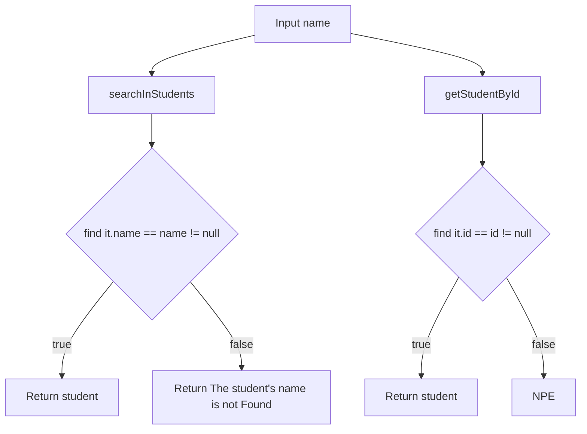

# Description
This is a Kotlin system to management student 🧑🏻‍🎓 information from a school 🏫

# Made with
[]()

## Additional Documentation

A modular Kotlin console project for managing student records in memory.

## Overview

This repository contains a simple but well-structured student management application that follows a layered design:

- Domain layer for core entities and repository contracts.
- Application layer for use-case orchestration.
- Infrastructure layer for data access implementations.
- Test layer for unit coverage of model, use cases, and repository behavior.

The project is currently console-oriented and uses an in-memory storage strategy, making it a good foundation for learning architecture and testing practices.

## Tech Stack

- Kotlin JVM
- Gradle (Kotlin DSL)
- JDK 21 toolchain
- JUnit 4 (`org.junit`)

## Project Structure

```text
app/src/main/kotlin/com/schoolstudentsystem/console/
	App.kt
	student/
		domain/
			StudentRepository.kt
			model/
				Student.kt
		application/
			CreateUseCases.kt
			SearchUseCases.kt
		infrastructure/
			databases/
				InMemoryStudentRepository.kt

app/src/test/kotlin/com/schoolstudentsystem/console/
	AppTest.kt
	student/
		application/
		domain/model/
		infrastructure/
```

## Architecture

### Domain

- `Student` is the core data model with `id`, `name`, and `grade`.
- `StudentRepository` defines the persistence contract.

### Application

- `CreateUseCases` coordinates student creation through the repository.
- `SearchUseCases` provides search by name and id.

### Infrastructure

- `InMemoryStudentRepository` implements `StudentRepository` with a `HashMap<Int, Student>`.
- Name search uses partial matching and case-insensitive comparison.

## Current Behavior

- `create`: inserts or replaces a student by id in the in-memory map.
- `get`: returns all students as a list.
- `getStudentById`: throws if the id does not exist.
- `searchById` use case: converts missing id exceptions into `null`.
- `searchByName`: returns the first matching student or `null`.

## Validation Requirements and Flow Design

The diagram below documents the current search flow behavior for lookup by name and by id.



### Validation Notes

- Name lookup returns a student when the name exists.
- Name lookup returns an explicit not-found message when no match exists.
- Id lookup returns a student when the id exists.
- Id lookup can fail with an error path (NPE) when the id does not exist.

## Build and Run

From the repository root:

```bash
./gradlew run
```

## Run Tests

```bash
./gradlew test
```

## Next Design Steps

- Add a dedicated `AddAStudentUseCase` (or rename `CreateUseCases`) with explicit validation rules.
- Introduce a result type (`Success` / `ValidationError`) instead of relying on exceptions for control flow.
- Add test cases for invalid id, blank name, invalid grade, and duplicate id scenarios.